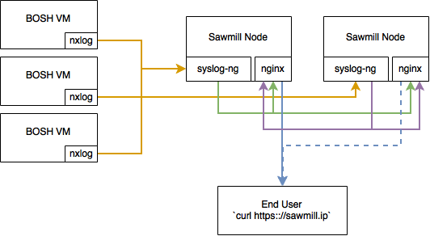

# Deploy Sawmill with BOSH

Sawmill is a system for aggregating logs into a single stream,
which the consumer can then filter off of. It works fairly simply.
Send your syslog data to any single node in the sawmill cluster.
Connect via HTTP (or web sockets) to any node in the sawmill cluster.
Watch the logs scroll by. Sawmill exists solely to stream live log data
to operators. There are no intentions of adding buffering, or searching
capabilities. It's simply here as an aid live debugging across multiple
systems. For archiving logs, you may wish to send the sawmill stream into
a long term storage facility (S3?). This release may provide that
functionality down the road.

In the future there will be a helpful client to assist in filtering
logs, to target your searches. For now, you sadly have to `curl https://sawmill_ip | grep <stuff>`

* [Concourse CI](https://ci.starkandwayne.com/teams/main/pipelines/sawmill-boshrelease?groups=sawmill-boshrelease)
* Pull requests will be automatically tested against a bosh-lite (see `testflight-pr` job)
* Discussions and CI notifications at [#sawmill-boshrelease channel](https://cloudfoundry.slack.com/messages/C6SUUTMDJ/) on https://slack.cloudfoundry.org

## Deploying Sawmill

To use this BOSH release:

```
export BOSH_ENVIRONMENT=<alias>
export BOSH_DEPLOYMENT=sawmill
git clone https://github.com/cloudfoundry-community/sawmill-boshrelease.git
cd sawmill-boshrelease
bosh deploy manifests/sawmill.yml --vars-store=tmp/creds.yml
```

To run the smoke tests:

```
bosh run-errand smoke-tests
```

## Sending Logs to Sawmill

We strongly recommend using [nxlog](https://github.com/hybris/nxlog-boshrelease)
to send the logs from your BOSH jobs into Sawmill. The only configuration required
is to provide `nxlog` with the IP:PORT of syslog for one of your Sawmill servers.
This will take most logs in `/var/vcap/sys/log`, and ship them via syslog to Sawmill.
Some sanity exlusions are done by default, but inclusions/exclusions are fully customizable.

We also strongly recommend against installing [nxlog](https://github.com/hybris/nxlog-boshrelease)
on your Sawmill servers, to avoid logging loops. If you do, you should avoid logging the nginx access
log, syslog-ng debug log, and syslog-ng stderr log.

## Streaming Logs from Sawmill

To retrieve logs from Sawmill, you have a couple options:

### HTTPS

Run a `curl -u username:password https://your.sawmill.ip` to receive the full
sawmill stream. To limit it, pipe the output through grep.

### WSS

Connect your preferred WebSockets client to `https://your.sawmill.ip/ws`, specifying
your username and password. Watch the data stream through!

### Logemon-GO!

Stay tuned for the logemon-go utility for simplified streaming and filtering of
Sawmill data. It will make use of the formatting of messages from
[nxlog-boshrelease](https://github.com/hybris/nxlog-boshrelease), which is why we
strongly recommend using it to send log data into sawmill.

## Architecture



### High Availability and Scaling

Sawmill itself supports high availability out of the box. Logs sent to any of its servers
are sent to any available node in the pool. Once processed, the log is sent to every Sawmill
node's web publisher. This allows you to connect to any nodein the cluster, and receive
all log data. If any node goes down, traffic will be rerouted to remaining up nodes,
and come through as expected. If the node you are streaming from goes down, you can either
reconnect to a different node in the cluster, or stick a load balancer in front of Sawmill,
and reconnect to that. Similarly nodes submitting logs will need to do the same, if the node
they communicate with goes away.

Note, due to this design, as you scale up node count, throughput may be reduced,
since your log messages are sent to each server in the cluster.

### Security Notes

Sawmill uses SSL to transmit log data from syslog to the end user. However,
it does not support encryption on the syslog side. In the future, we will add
support to submit logs using syslog + TLS.

Sawmill uses HTTP Basic Auth for authentication/authorization. It supports
arbitrary numbers of user accounts to access it, so you may dole out access
individually, or in bulk, as your security policy requires. We chose HTTP Basic
Auth to keep moving parts minimal in the logging system, since the last thing
you want to do while troubleshooting your authentication system is find that
you cannot log into Sawmill to stream its logs anymore. By default on `warden`,
Sawmill ships with an admin/admin user for bosh-lite. All other environments
require you to add your own user + passwords.

If the SSL cert/key are not provided, a random one will be generated for you,
but you will likely need to set the `sawmill.skip_ssl_verify` property for things
to work properly.
